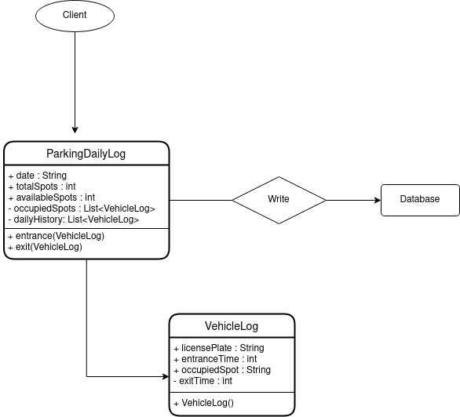

# The Parking Lot App

## PT
Esse é um app de exemplo para o gerenciamento de um estacionamento onde você pode registrar as entradas e saídas, anotar as placas e recuperar o seu histórico diário. Todos os dados são salvos no armazenamento interno do celular.

Esse projeto é baseado na estrutura de Clean Architecture e princípios de SOLID, DRY e Clean Code.
Foi desenhado com o padrão MVP e usando o pacote Get como gerenciador de estados, esse projeto é focado em ser um sistema leve e escalável.
**Padrões de Projeto usados:**
- [x] Factory
- [x] Interface
- [x] Adapter  

## EN
An example app to manage a parking lot where you can register the entrances and exits, note the license plate and recover your daily history. All the data is saved on your phone's storage.

### Project Structure
This project is based on Clean Architecture structure and the SOLID, DRY and Clean Code principles.
Designs with the MVP architectural pattern and using Get package as state manager, this should be a lightweight and scalable system.
**Used Design Patterns:**
- [x] Factory
- [x] Interface
- [x] Adapter  

### Classes Diagram

